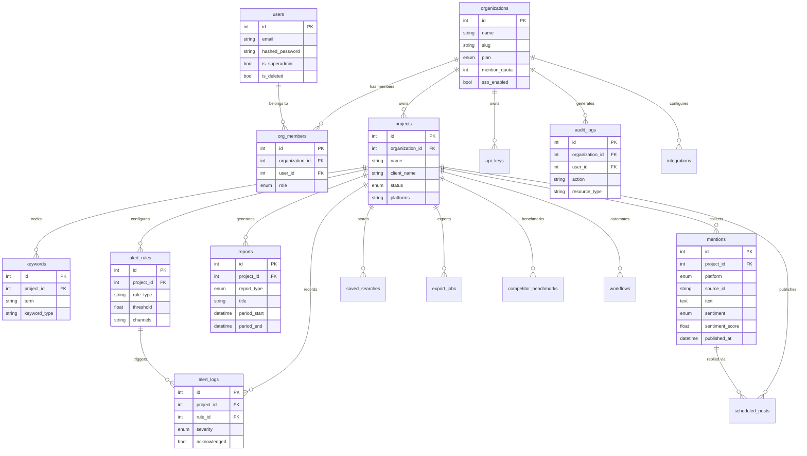

# KhushFus Data Dictionary

**Source of truth:** `shared/models.py`
**Database:** PostgreSQL (primary), SQLite (development/test)
**ORM:** SQLAlchemy 2.x with async asyncpg driver

---

## Table of Contents

1. [Enum Types](#enum-types)
2. [Tables](#tables)
   - [organizations](#organizations)
   - [users](#users)
   - [org_members](#org_members)
   - [api_keys](#api_keys)
   - [projects](#projects)
   - [keywords](#keywords)
   - [mentions](#mentions)
   - [reports](#reports)
   - [alert_rules](#alert_rules)
   - [alert_logs](#alert_logs)
   - [saved_searches](#saved_searches)
   - [scheduled_posts](#scheduled_posts)
   - [export_jobs](#export_jobs)
   - [integrations](#integrations)
   - [competitor_benchmarks](#competitor_benchmarks)
   - [workflows](#workflows)
   - [audit_logs](#audit_logs)
   - [platform_quotas](#platform_quotas)
3. [ER Diagram](#er-diagram)

---

## Enum Types

### `ProjectStatus`
Controls the operational state of a project.

| Value | Meaning |
|-------|---------|
| `active` | Project is collecting and processing mentions |
| `paused` | Collection is suspended; existing data is retained |
| `archived` | Project is read-only; no new collection |

### `Platform`
Social media platforms supported by the collector service (22 values).

`twitter`, `facebook`, `instagram`, `linkedin`, `youtube`, `news`, `blog`, `forum`, `reddit`, `telegram`, `quora`, `press`, `tiktok`, `discord`, `threads`, `bluesky`, `pinterest`, `appstore`, `reviews`, `mastodon`, `podcast`, `other`

### `Sentiment`
Output of the NLP sentiment analysis pipeline.

| Value | Meaning |
|-------|---------|
| `positive` | Overall positive tone |
| `negative` | Overall negative tone |
| `neutral` | No strong sentiment |
| `mixed` | Both positive and negative elements present |

### `ReportType`
Time-period granularity for generated reports.

`hourly`, `daily`, `weekly`, `monthly`, `quarterly`, `yearly`, `custom`

### `ReportFormat`
Output file format for generated reports.

| Value | Meaning |
|-------|---------|
| `pdf` | PDF document via WeasyPrint |
| `pptx` | PowerPoint presentation |

### `AlertSeverity`
Severity level assigned to triggered alerts.

`low`, `medium`, `high`, `critical`

### `OrgRole`
RBAC roles within an organization.

| Value | Permissions |
|-------|-------------|
| `owner` | Full access, billing, delete organization |
| `admin` | Full access except billing |
| `manager` | Create/edit projects, manage team members |
| `analyst` | View and create reports, manage mentions |
| `viewer` | Read-only access |

### `PlanTier`
Subscription plan tiers.

| Value | Max Projects | Mention Quota/Month |
|-------|-------------|---------------------|
| `free` | 3 | 10,000 |
| `starter` | 10 | 100,000 |
| `professional` | 25 | 500,000 |
| `enterprise` | Unlimited | Custom |

### `ExportFormat`
Formats supported by the Export service.

`csv`, `excel`, `pdf`, `json`

### `ExportStatus`
Lifecycle state of an export job.

`pending` → `processing` → `completed` / `failed`

### `PublishStatus`
Lifecycle state of a scheduled post.

`draft` → `scheduled` → `published` / `failed`

### `WorkflowStatus`
State of a workflow automation rule.

`active`, `paused`, `completed`, `failed`

---

## Tables

### `organizations`

Root tenant entity. Every other row in the system belongs to an organization.

| Column | Type | Constraints | Description |
|--------|------|-------------|-------------|
| `id` | integer | PK | Auto-increment primary key |
| `name` | varchar(255) | NOT NULL | Display name |
| `slug` | varchar(100) | UNIQUE, INDEX | URL-safe identifier used in routing |
| `plan` | enum(PlanTier) | DEFAULT 'free' | Subscription tier |
| `mention_quota` | integer | DEFAULT 10000 | Maximum mentions per month |
| `mentions_used` | integer | DEFAULT 0 | Mentions consumed this month |
| `max_projects` | integer | DEFAULT 3 | Maximum number of active projects |
| `max_users` | integer | DEFAULT 5 | Maximum team members |
| `sso_enabled` | boolean | DEFAULT false | Whether SSO is enabled |
| `sso_provider` | varchar(50) | nullable | `saml` or `oidc` |
| `sso_metadata_url` | varchar(2000) | nullable | SAML metadata XML URL or OIDC discovery URL |
| `sso_entity_id` | varchar(255) | nullable | SAML entity ID |
| `logo_url` | varchar(2000) | nullable | Organization logo for white-labeling |
| `primary_color` | varchar(7) | nullable | Hex color code for white-labeling |
| `is_active` | boolean | DEFAULT true | Soft-disable without deletion |
| `created_at` | timestamp | server_default=now() | Creation timestamp |
| `updated_at` | timestamp | nullable, on_update=now() | Last modification timestamp |

**Relationships:** has many `org_members`, `projects`, `api_keys`, `audit_logs`

---

### `users`

Platform users. A user can be a member of multiple organizations.

| Column | Type | Constraints | Description |
|--------|------|-------------|-------------|
| `id` | integer | PK | Auto-increment primary key |
| `email` | varchar(255) | UNIQUE, INDEX | Login identifier |
| `hashed_password` | varchar(255) | nullable | bcrypt hash; NULL for SSO-only users |
| `full_name` | varchar(255) | NOT NULL | Display name |
| `avatar_url` | varchar(2000) | nullable | Profile photo URL |
| `sso_subject` | varchar(255) | nullable | External SSO provider's user ID |
| `is_active` | boolean | DEFAULT true | Account active flag |
| `is_superadmin` | boolean | DEFAULT false | Platform-level superadmin (bypasses RLS) |
| `is_deleted` | boolean | DEFAULT false, INDEX | Soft delete flag |
| `deleted_at` | timestamp | nullable | When the account was soft-deleted |
| `last_login_at` | timestamp | nullable | Last successful authentication |
| `created_at` | timestamp | server_default=now() | Registration timestamp |
| `updated_at` | timestamp | nullable, on_update=now() | Last profile update |

**Relationships:** has many `org_members` (memberships)

---

### `org_members`

Join table linking users to organizations with a specific role.

| Column | Type | Constraints | Description |
|--------|------|-------------|-------------|
| `id` | integer | PK | Auto-increment primary key |
| `organization_id` | integer | FK → organizations, INDEX | Parent organization |
| `user_id` | integer | FK → users, INDEX | Member user |
| `role` | enum(OrgRole) | DEFAULT 'viewer' | RBAC role within this organization |
| `invited_by` | integer | nullable | User ID of the inviter |
| `joined_at` | timestamp | server_default=now() | When membership was created |

**Unique constraint:** `(organization_id, user_id)` — one membership per user per org

---

### `api_keys`

Machine-to-machine API keys for organizations.

| Column | Type | Constraints | Description |
|--------|------|-------------|-------------|
| `id` | integer | PK | Auto-increment primary key |
| `organization_id` | integer | FK → organizations, INDEX | Owning organization |
| `name` | varchar(255) | NOT NULL | Human-readable label |
| `key_hash` | varchar(255) | UNIQUE, INDEX | bcrypt hash of the full API key |
| `prefix` | varchar(10) | NOT NULL | First 8 chars of the key (for identification in UI) |
| `scopes` | varchar(200) | DEFAULT 'read' | Comma-separated: `read`, `write`, `admin` |
| `rate_limit` | integer | DEFAULT 1000 | Max requests per hour |
| `is_active` | boolean | DEFAULT true | Revocation flag |
| `last_used_at` | timestamp | nullable | Last successful authentication |
| `expires_at` | timestamp | nullable | Optional expiry; NULL = never expires |
| `created_at` | timestamp | server_default=now() | Creation timestamp |

---

### `projects`

A social listening project. The primary tenant-scoped entity. Each project has a set of keywords and target platforms.

| Column | Type | Constraints | Description |
|--------|------|-------------|-------------|
| `id` | integer | PK | Auto-increment primary key |
| `organization_id` | integer | FK → organizations, INDEX | Owning organization (tenant key) |
| `name` | varchar(255) | NOT NULL | Project display name |
| `description` | varchar(2000) | nullable | Optional project description |
| `client_name` | varchar(255) | NOT NULL | Client or brand being monitored |
| `status` | enum(ProjectStatus) | DEFAULT 'active' | Operational state |
| `platforms` | varchar(500) | NOT NULL | Comma-separated Platform values |
| `competitor_ids` | varchar(500) | nullable | Comma-separated project IDs for competitive comparison |
| `created_by` | integer | FK → users (SET NULL) | User who created the project |
| `updated_by` | integer | FK → users (SET NULL) | User who last modified the project |
| `is_deleted` | boolean | DEFAULT false, INDEX | Soft delete flag |
| `deleted_at` | timestamp | nullable | Soft deletion timestamp |
| `created_at` | timestamp | server_default=now() | Creation timestamp |
| `updated_at` | timestamp | server_default=now(), on_update=now() | Last modification timestamp |

**Relationships:** has many `keywords`, `mentions`, `reports`, `alert_rules`, `saved_searches`
**RLS protected:** yes

---

### `keywords`

Search terms tracked by a project. The Collector service uses these to query each platform.

| Column | Type | Constraints | Description |
|--------|------|-------------|-------------|
| `id` | integer | PK | Auto-increment primary key |
| `project_id` | integer | FK → projects, INDEX | Parent project |
| `term` | varchar(255) | NOT NULL | The search term or keyword |
| `keyword_type` | varchar(50) | DEFAULT 'brand' | Classification: `brand`, `product`, `handle`, `competitor`, `topic` |
| `is_active` | boolean | DEFAULT true | Whether this keyword is actively monitored |
| `created_at` | timestamp | server_default=now() | Creation timestamp |
| `updated_at` | timestamp | nullable, on_update=now() | Last modification timestamp |

---

### `mentions`

The highest-volume table. Each row is a social media post, article, or comment that matched a project's keywords.

**Partitioning recommendation:** Range partition by `published_at` (monthly) at scale using `pg_partman`.

| Column | Type | Constraints | Description |
|--------|------|-------------|-------------|
| `id` | integer | PK | Auto-increment primary key |
| `project_id` | integer | FK → projects, INDEX | Owning project |
| `platform` | enum(Platform) | INDEX | Source platform |
| `source_id` | varchar(255) | INDEX, nullable | Platform's native post/content ID |
| `source_url` | varchar(2000) | nullable | Direct URL to the original content |
| `text` | text | NOT NULL | Full text of the mention |
| `author_name` | varchar(255) | nullable | Display name of the author |
| `author_handle` | varchar(255) | nullable | Platform handle/username |
| `author_followers` | integer | nullable | Follower count at collection time |
| `author_profile_url` | varchar(2000) | nullable | Author's profile URL |
| `likes` | integer | DEFAULT 0 | Engagement: likes/reactions |
| `shares` | integer | DEFAULT 0 | Engagement: shares/retweets |
| `comments` | integer | DEFAULT 0 | Engagement: comment count |
| `reach` | integer | DEFAULT 0 | Estimated impressions/reach |
| `sentiment` | enum(Sentiment) | INDEX | NLP-determined sentiment |
| `sentiment_score` | float | DEFAULT 0.0 | Numeric sentiment score (-1.0 to +1.0) |
| `language` | varchar(10) | nullable | ISO 639-1 language code |
| `matched_keywords` | text | nullable | JSON array of matched keyword terms |
| `topics` | text | nullable | JSON array of BERTopic-identified topics |
| `entities` | text | nullable | JSON array of spaCy-extracted named entities |
| `has_media` | boolean | DEFAULT false | Whether the mention contains media |
| `media_type` | varchar(20) | nullable | `image`, `video`, or `audio` |
| `media_url` | varchar(2000) | nullable | URL to the media asset |
| `media_ocr_text` | text | nullable | Text extracted from images via OCR |
| `media_labels` | text | nullable | JSON: detected objects/logos from image analysis |
| `media_transcript` | text | nullable | Transcript from video/audio content |
| `author_influence_score` | float | nullable | Enrichment: computed influence score (0–100) |
| `author_is_bot` | boolean | nullable | Enrichment: bot detection flag |
| `author_org` | varchar(255) | nullable | Enrichment: resolved organization name |
| `virality_score` | float | nullable | Enrichment: computed virality score |
| `published_at` | timestamp | INDEX, nullable | Original publication datetime |
| `collected_at` | timestamp | server_default=now() | When KhushFus collected this mention |
| `is_flagged` | boolean | DEFAULT false | Manual review flag |
| `assigned_to` | varchar(255) | nullable | Username of the assigned team member |
| `is_deleted` | boolean | DEFAULT false, INDEX | Soft delete flag |
| `deleted_at` | timestamp | nullable | Soft deletion timestamp |

**Unique constraint:** `(project_id, source_id, platform)` — prevents duplicate mentions
**Composite indexes:** `(project_id, published_at)`, `(project_id, sentiment)`, `(project_id, platform)`, `(project_id, source_id, platform)`, `(collected_at)`
**RLS protected:** yes (via project → organization_id)

---

### `reports`

Metadata for generated analytics reports.

| Column | Type | Constraints | Description |
|--------|------|-------------|-------------|
| `id` | integer | PK | Auto-increment primary key |
| `project_id` | integer | FK → projects, INDEX | Owning project |
| `report_type` | enum(ReportType) | NOT NULL | Time granularity |
| `title` | varchar(255) | NOT NULL | Report title |
| `period_start` | timestamp | NOT NULL | Reporting period start |
| `period_end` | timestamp | NOT NULL | Reporting period end |
| `format` | varchar(10) | DEFAULT 'pdf' | Output format |
| `file_path` | varchar(1000) | nullable | Path to the generated file |
| `data_json` | text | nullable | Serialized report data payload |
| `created_by` | integer | FK → users (SET NULL) | Requesting user |
| `updated_by` | integer | FK → users (SET NULL) | Last modifier |
| `is_deleted` | boolean | DEFAULT false, INDEX | Soft delete flag |
| `deleted_at` | timestamp | nullable | Soft deletion timestamp |
| `created_at` | timestamp | server_default=now() | Request timestamp |
| `updated_at` | timestamp | nullable, on_update=now() | Last update |

---

### `alert_rules`

User-configured rules that trigger notifications when conditions are met.

| Column | Type | Constraints | Description |
|--------|------|-------------|-------------|
| `id` | integer | PK | Auto-increment primary key |
| `project_id` | integer | FK → projects, INDEX | Owning project |
| `name` | varchar(255) | NOT NULL | Rule display name |
| `rule_type` | varchar(50) | NOT NULL | e.g., `sentiment_spike`, `volume_threshold`, `keyword_match` |
| `threshold` | float | DEFAULT 0.0 | Trigger value for numeric rules |
| `window_minutes` | integer | DEFAULT 60 | Evaluation window in minutes |
| `channels` | varchar(200) | DEFAULT 'email' | Comma-separated: `email`, `slack`, `webhook` |
| `webhook_url` | varchar(2000) | nullable | SSRF-validated destination URL for webhook delivery |
| `is_active` | boolean | DEFAULT true | Rule enable/disable flag |
| `created_by` | integer | FK → users (SET NULL) | Creator |
| `updated_by` | integer | FK → users (SET NULL) | Last modifier |
| `created_at` | timestamp | server_default=now() | Creation timestamp |
| `updated_at` | timestamp | nullable, on_update=now() | Last update |

---

### `alert_logs`

Immutable log of all fired alerts. One row per alert trigger event.

| Column | Type | Constraints | Description |
|--------|------|-------------|-------------|
| `id` | integer | PK | Auto-increment primary key |
| `project_id` | integer | FK → projects, INDEX | Owning project |
| `rule_id` | integer | FK → alert_rules (SET NULL), nullable | The rule that triggered this alert |
| `alert_type` | varchar(50) | NOT NULL | Alert category |
| `severity` | enum(AlertSeverity) | NOT NULL | Alert severity |
| `title` | varchar(255) | NOT NULL | Alert summary |
| `description` | varchar(5000) | nullable | Detailed alert description |
| `data_json` | text | nullable | Context data for the alert (mention IDs, metric values) |
| `acknowledged` | boolean | DEFAULT false | Whether a team member acknowledged this alert |
| `created_at` | timestamp | server_default=now(), INDEX | Alert fire timestamp |

**Composite index:** `(project_id, created_at)`

---

### `saved_searches`

User-saved search queries for quick reuse.

| Column | Type | Constraints | Description |
|--------|------|-------------|-------------|
| `id` | integer | PK | Auto-increment primary key |
| `project_id` | integer | FK → projects, INDEX | Owning project |
| `user_id` | integer | FK → users, INDEX | Owner |
| `name` | varchar(255) | NOT NULL | Search name |
| `query_json` | varchar(10000) | NOT NULL | Full OpenSearch query as JSON |
| `created_at` | timestamp | server_default=now() | Creation timestamp |
| `updated_at` | timestamp | nullable, on_update=now() | Last update |

---

### `scheduled_posts`

Posts scheduled for future publishing to social platforms.

| Column | Type | Constraints | Description |
|--------|------|-------------|-------------|
| `id` | integer | PK | Auto-increment primary key |
| `project_id` | integer | FK → projects, INDEX | Owning project |
| `created_by` | integer | FK → users (SET NULL), nullable | Creator |
| `updated_by` | integer | FK → users (SET NULL), nullable | Last modifier |
| `platform` | enum(Platform) | NOT NULL | Target publishing platform |
| `content` | varchar(10000) | NOT NULL | Post body text |
| `media_urls` | varchar(2000) | nullable | Comma-separated media attachment URLs |
| `scheduled_at` | timestamp | INDEX | When to publish |
| `published_at` | timestamp | nullable | When actually published |
| `status` | enum(PublishStatus) | DEFAULT 'draft', INDEX | Lifecycle state |
| `platform_post_id` | varchar(255) | nullable | Native platform ID after successful publish |
| `approved_by` | integer | nullable | User ID of approver (approval workflow) |
| `error_message` | varchar(2000) | nullable | Failure reason |
| `reply_to_mention_id` | integer | FK → mentions (SET NULL), nullable | If replying to a tracked mention |
| `created_at` | timestamp | server_default=now() | Creation timestamp |
| `updated_at` | timestamp | nullable, on_update=now() | Last update |

---

### `export_jobs`

Async export job tracking.

| Column | Type | Constraints | Description |
|--------|------|-------------|-------------|
| `id` | integer | PK | Auto-increment primary key |
| `project_id` | integer | FK → projects, INDEX | Owning project |
| `user_id` | integer | FK → users (SET NULL), nullable | Requesting user |
| `export_format` | enum(ExportFormat) | NOT NULL | Output format |
| `filters_json` | varchar(10000) | nullable | Applied mention filters as JSON |
| `status` | enum(ExportStatus) | DEFAULT 'pending', INDEX | Job state |
| `file_path` | varchar(1000) | nullable | Path to completed export file |
| `row_count` | integer | nullable | Number of rows exported |
| `error_message` | varchar(2000) | nullable | Failure reason |
| `created_at` | timestamp | server_default=now() | Job creation timestamp |
| `completed_at` | timestamp | nullable | Job completion timestamp |
| `updated_at` | timestamp | nullable, on_update=now() | Last update |

---

### `integrations`

CRM and BI tool integration configurations per organization.

| Column | Type | Constraints | Description |
|--------|------|-------------|-------------|
| `id` | integer | PK | Auto-increment primary key |
| `organization_id` | integer | FK → organizations, INDEX | Owning organization |
| `integration_type` | varchar(50) | NOT NULL | `salesforce`, `hubspot`, `slack`, `tableau`, `webhook` |
| `name` | varchar(255) | NOT NULL | Display name |
| `config_json` | varchar(10000) | NOT NULL | Encrypted connection config (credentials, endpoints) |
| `is_active` | boolean | DEFAULT true | Enable/disable flag |
| `last_sync_at` | timestamp | nullable | Last successful data sync |
| `created_at` | timestamp | server_default=now() | Creation timestamp |
| `updated_at` | timestamp | nullable, on_update=now() | Last update |

---

### `competitor_benchmarks`

Periodic share-of-voice and sentiment comparison snapshots between a project and its competitors.

| Column | Type | Constraints | Description |
|--------|------|-------------|-------------|
| `id` | integer | PK | Auto-increment primary key |
| `project_id` | integer | FK → projects, INDEX | The subject project |
| `competitor_project_id` | integer | FK → projects | The competitor project |
| `period_start` | timestamp | NOT NULL | Comparison period start |
| `period_end` | timestamp | NOT NULL | Comparison period end |
| `data_json` | text | NOT NULL | Metrics: share_of_voice, sentiment_comparison, engagement_delta |
| `created_at` | timestamp | server_default=now() | Snapshot creation time |

---

### `workflows`

Workflow automation rules: trigger conditions mapped to automated actions.

| Column | Type | Constraints | Description |
|--------|------|-------------|-------------|
| `id` | integer | PK | Auto-increment primary key |
| `project_id` | integer | FK → projects, INDEX | Owning project |
| `created_by` | integer | FK → users (SET NULL), nullable | Creator |
| `updated_by` | integer | FK → users (SET NULL), nullable | Last modifier |
| `name` | varchar(255) | NOT NULL | Workflow name |
| `trigger_json` | varchar(10000) | NOT NULL | Trigger condition as JSON (e.g., sentiment=negative, threshold=0.5) |
| `actions_json` | varchar(10000) | NOT NULL | Actions as JSON (e.g., create_alert, send_email, assign_mention) |
| `status` | enum(WorkflowStatus) | DEFAULT 'active' | Workflow state |
| `executions` | integer | DEFAULT 0 | Total number of times this workflow has fired |
| `created_at` | timestamp | server_default=now() | Creation timestamp |
| `updated_at` | timestamp | nullable, on_update=now() | Last update |

---

### `audit_logs`

Immutable audit trail for GDPR compliance and security review. One row per user action.

| Column | Type | Constraints | Description |
|--------|------|-------------|-------------|
| `id` | integer | PK | Auto-increment primary key |
| `organization_id` | integer | FK → organizations, INDEX | Owning organization |
| `user_id` | integer | FK → users (SET NULL), nullable | Acting user (NULL for system actions) |
| `action` | varchar(100) | NOT NULL | Action identifier: `project.create`, `mention.flag`, `report.generate`, `user.invite` |
| `resource_type` | varchar(50) | NOT NULL | Resource type: `project`, `mention`, `report`, `user` |
| `resource_id` | integer | nullable | ID of the affected resource |
| `details_json` | text | nullable | Additional context (before/after values, IP, user agent) |
| `ip_address` | varchar(45) | nullable | Client IP address (supports IPv6) |
| `created_at` | timestamp | server_default=now(), INDEX | Event timestamp |

**Composite index:** `(organization_id, created_at)`
**RLS protected:** yes

---

### `platform_quotas`

Rate limit tracking for external platform API calls. One row per platform/endpoint combination.

| Column | Type | Constraints | Description |
|--------|------|-------------|-------------|
| `id` | integer | PK | Auto-increment primary key |
| `platform` | enum(Platform) | INDEX | Target platform |
| `endpoint` | varchar(255) | NOT NULL | API endpoint identifier |
| `max_requests` | integer | NOT NULL | Maximum requests in the window |
| `window_seconds` | integer | NOT NULL | Rolling window duration |
| `requests_used` | integer | DEFAULT 0 | Requests consumed in current window |
| `window_reset_at` | timestamp | NOT NULL | When the current window resets |
| `updated_at` | timestamp | server_default=now(), on_update=now() | Last counter update |

**Unique constraint:** `(platform, endpoint)`

---

## ER Diagram

